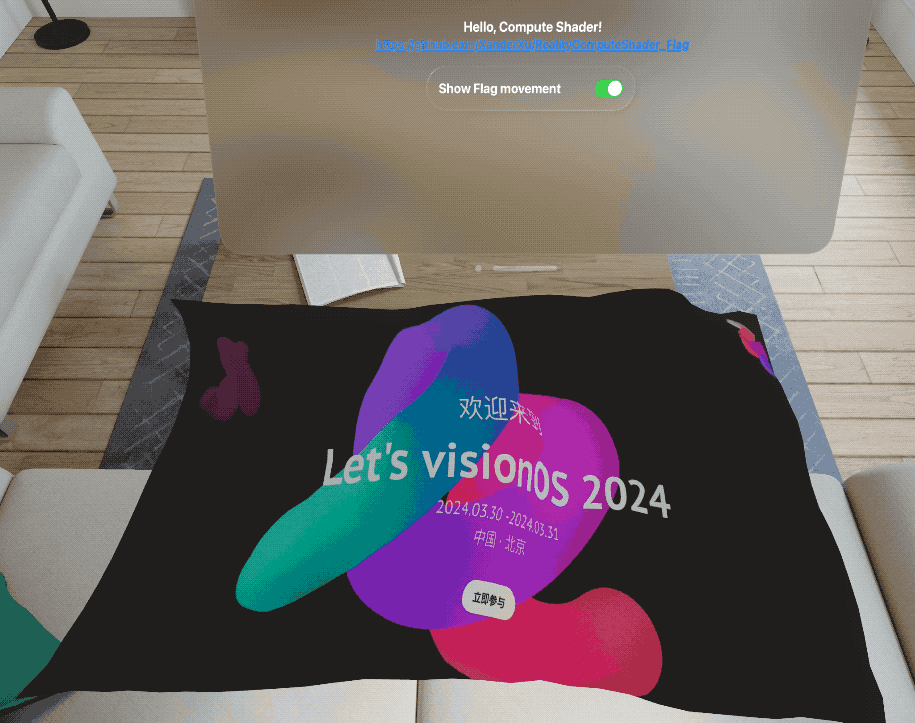

# RealityComputeShader_Flag
Compute Shader in Vision Pro

文章讲解：
* 掘金：[试玩 visionOS 2 上的 LowLevelMesh 与 Compute Shader：模拟布料旗子](https://juejin.cn/spost/7380513226155262006)
* 小专栏：[试玩 visionOS 2 上的 LowLevelMesh 与 Compute Shader：模拟布料旗子](https://xiaozhuanlan.com/topic/7095834216)

